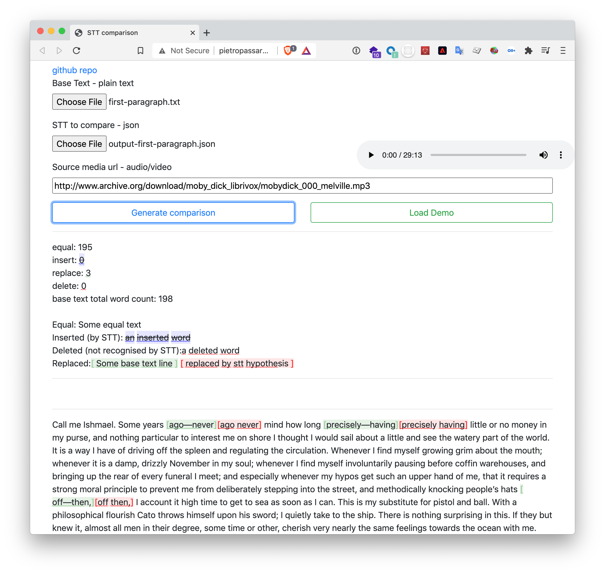

# Visually inspect results guide

To try out `transpose-timestamps` in this repo you can run `src/example-usage.js`.

And to very/inspect the result, you can use [`stt-align-node` web interface](http://pietropassarelli.com/stt-align-node)
By adding the base text you used for the alignment and the output json you got from `transpose-timestamps`

Here's an example below.

As mentioned in the README It's a limitation `transpose-timestamps` that because of constraints with the alignment process the result will split dashed words `-` into (two) separate words. But for now you can consider the alignment sucesfull if the only differences you see are dash separated words `-` like in the screenshot above.

If you have a link to audio file, you can also add that, and click on the words to listen if their timecodes corresponds to the correct point in the audio.

[Eg for the moby dick example you can use the audio from the librivox recording, chapter 1](http://www.archive.org/download/moby_dick_librivox/mobydick_001_002_melville.mp3)
